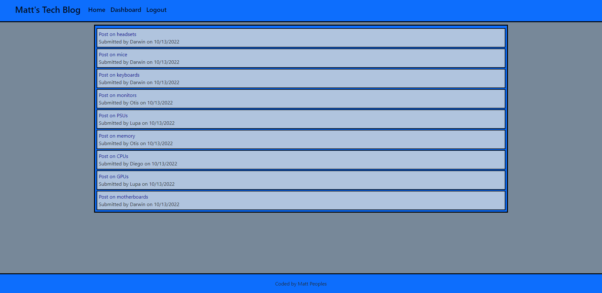

# Matt's Tech Blog 

This assignment was to build a CMS-style blog site similar to a Wordpress site, where developers can publish their blog posts and comment on other developers’ posts as well.

## Table of Contents

- [Skills Practiced](#skills-practiced)
- [Installation](#installation)
- [Usage](#usage)
- [Screenshots](#screeenshots)
- [Deployed App](#link-to-deployed-app)
- [Questions](#questions)

## Skills Practiced

- Building a site with its structure following the Model-View-Controller paradigm.
- Using express-handlebars pachage to use Handlebars.js for views.
- Deploying to heroku with JAWSDB for a realtime database.
- Clean styling with Bootstrap.
- Making server calls using GET, PUT, POST, and DELETE.
- Understanding the flow of data and modularization.
- Using .env to protect sensitive data.
- Using session cookies to track users.

## Installation

If you want to download the app locally follow these steps.

1. Fork the repository
2. Clone the repo locally
3. In the terminal run "npm i" to download the dependencies.
4. Run "npm start" to initiate the app.

## Usage

Allows a user to make blog posts and also comment on other user's posts.

## Screeenshots

## Link to Deployed App

[Deployed App](https://guarded-chamber-72241.herokuapp.com/)

## Questions

If you have any questions about this projects, please contact me directly at mep.summit@gmail.com. You can view more of my projects at https://github.com/peoplesm.
